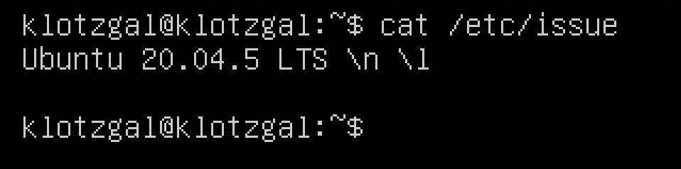
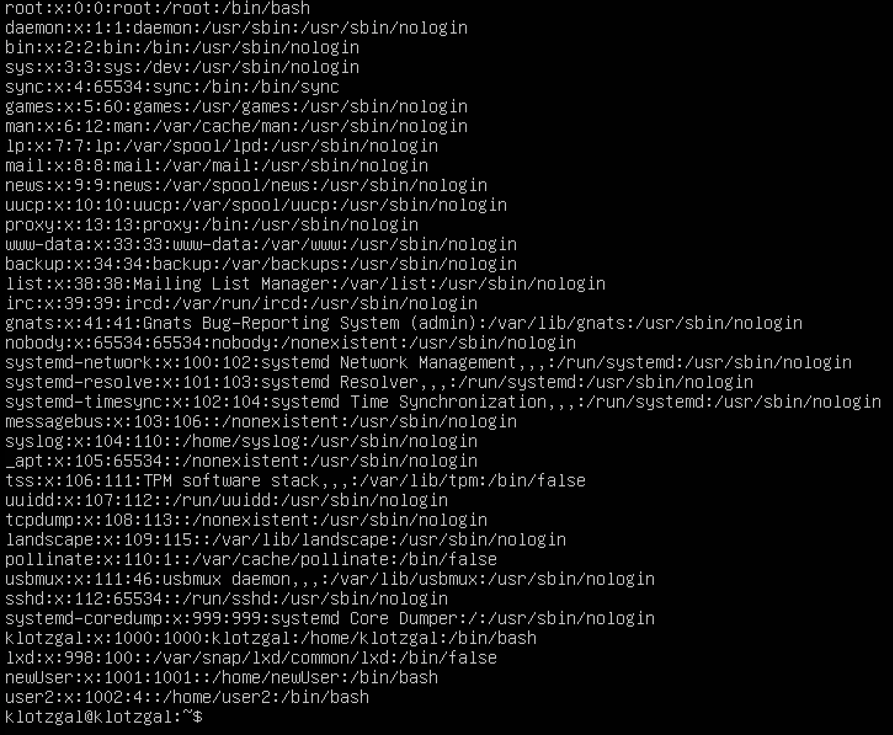
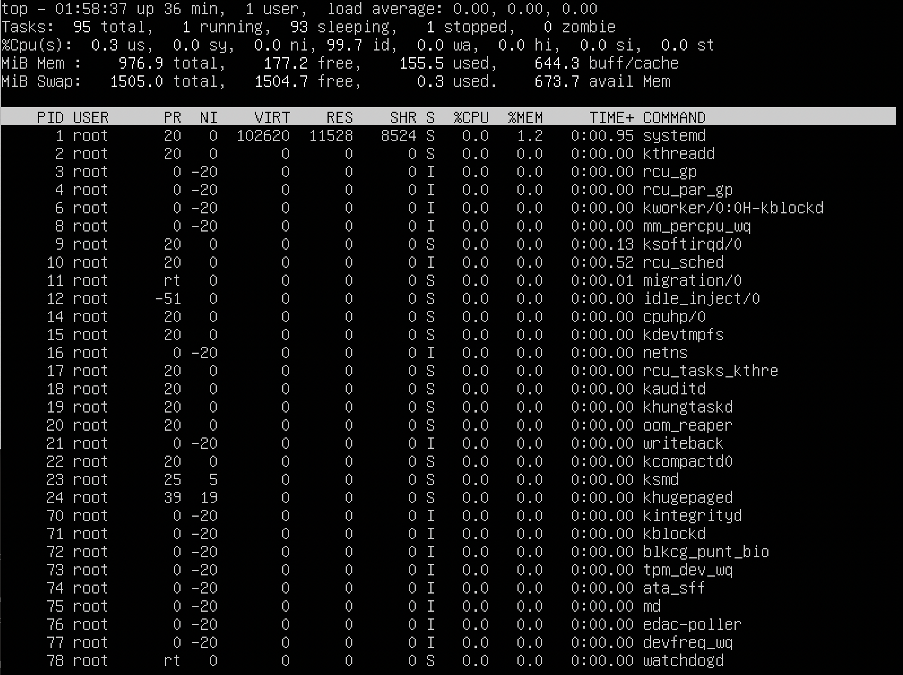

# Операционные системы UNIX/Linux (Базовый).

## Part 1. Установка ОС

**== Задание ==**

##### Установить **Ubuntu 20.04 Server LTS** без графического интерфейса. (Используем программу для виртуализации - VirtualBox)

- Графический интерфейс должен отсутствовать.

- Узнайте версию Ubuntu, выполнив команду \
`cat /etc/issue.`
- Вставьте скриншот с выводом команды.

## Part 2. Создание пользователя  
  
`-` Установленная система -- это хорошо, но вдруг ей будет пользоваться кто-то ещё? Сейчас научу тебя созданию нового пользователя.

**== Задание ==**

##### Создать пользователя, отличного от пользователя, который создавался при установке. Пользователь должен быть добавлен в группу `adm`.

- Вставьте скриншот вызова команды для создания пользователя.

- Новый пользователь должен быть в выводе команды \
`cat /etc/passwd`
- Вставьте скриншот с выводом команды.

## Part 3. Настройка сети ОС

`-` В нашем мире без интернета далеко не уедешь. Однако, поскольку мы хотим подготовить тебя к роли системного администратора, я покажу немного больше, чем просто настройку сети.

`-` Перед тем, как мы приступим, советую почитать про сетевые интерфейсы и DHCP.

**== Задание ==**

##### Задать название машины вида user-1
1. sudo vim /etc/hostname
2. Изменил название и вышел из vim.
##### Установить временную зону, соответствующую вашему текущему местоположению.

##### Вывести названия сетевых интерфейсов с помощью консольной команды.

- Интерфейс lo используется для отладки сетевых программ и запуска серверных приложений на локальной машине. С этим интерфейсом всегда связан адрес 127.0.0.1.
##### Используя консольную команду получить ip адрес устройства, на котором вы работаете, от DHCP сервера. 

- DHCP(Dynamic Host Configuration Protocol) — протокол прикладного уровня модели TCP/IP, служит для назначения IP-адреса клиенту. 
##### Определить и вывести на экран внешний ip-адрес шлюза (ip) и внутренний IP-адрес шлюза, он же ip-адрес по умолчанию (gw).

##### Задать статичные (заданные вручную, а не полученные от DHCP сервера) настройки ip, gw, dns (использовать публичный DNS серверы, например 1.1.1.1 или 8.8.8.8).

##### Перезагрузить виртуальную машину. Убедиться, что статичные сетевые настройки (ip, gw, dns) соответствуют заданным в предыдущем пункте.  

- В отчёте опишите, что сделали для выполнения всех семи пунктов (можно как текстом, так и скриншотами).
- Успешно пропинговать удаленные хосты 1.1.1.1 и ya.ru и вставить в отчёт скрин с выводом команды. В выводе команды должна быть фраза "0% packet loss".

## Part 4. Обновление ОС

**== Задание ==**

##### Обновить системные пакеты до последней на момент выполнения задания версии.  

- После обновления системных пакетов, если ввести команду обновления повторно, должно появится сообщение, что обновления отсутствуют.
- Вставить скриншот с этим сообщением в отчёт.

## Part 5. Использование команды **sudo**

**== Задание ==**

##### Разрешить пользователю, созданному в [Part 2](#part-2-создание-пользователя), выполнять команду sudo.

- Команда sudo позволяет запускать программы от имени другого пользователя, в том числе root.   
- Поменять hostname ОС от имени пользователя, созданного в пункте [Part 2](#part-2-создание-пользователя) (используя sudo).

- Вставить скрин с изменённым hostname в отчёт.

## Part 6. Установка и настройка службы времени

`-` Хоть у нас сейчас и стоит правильное время, оно может быть таким не всегда. Чтобы не настраивать его каждый раз самим, существуют службы синхронизации времени.

**== Задание ==**

##### Настроить службу автоматической синхронизации времени.  

- Вывести время, часового пояса, в котором вы сейчас находитесь.
- Вывод следующей команды должен содержать `NTPSynchronized=yes`: \
  `timedatectl show`
- Вставить скрины с корректным временем и выводом команды в отчёт.

## Part 7. Установка и использование текстовых редакторов 

**== Задание ==**

##### Установить текстовые редакторы **VIM** (+ любые два по желанию **NANO**, **MCEDIT**, **JOE** и т.д.)  
##### Используя каждый из трех выбранных редакторов, создайте файл *test_X.txt*, где X -- название редактора, в котором создан файл. Напишите в нём свой никнейм, закройте файл с сохранением изменений.  
- В отчёт вставьте скриншоты:
  - Из каждого редактора с содержимым файла перед закрытием.
- В отчёте укажите, что сделали для выхода с сохранением изменений.
- VIM

Для выхода с сохранением (ESC, :wq, ENTER)

Для выхода с сохранением (Ctrl + x, y, Enter, Enter)

Для выхода с сохранением (ESC и выбор YES)

##### Используя каждый из трех выбранных редакторов, откройте файл на редактирование, отредактируйте файл, заменив никнейм на строку "21 School 21", закройте файл без сохранения изменений.
- В отчёт вставьте скриншоты:
    - Из каждого редактора с содержимым файла после редактирования.
- В отчёте укажите, что сделали для выхода без сохранения изменений.

Для выхода без сохранения (ESC, :q!, ENTER)

Для выхода без сохранения (Ctrl + x, n, Enter)

Для выхода без сохранения (ESC и выбор NO)

##### Используя каждый из трех выбранных редакторов, отредактируйте файл ещё раз (по аналогии с предыдущим пунктом), а затем освойте функции поиска по содержимому файла (слово) и замены слова на любое другое.
- В отчёт вставьте скриншоты:
    - Из каждого редактора с результатами поиска слова.
    - Из каждого редактора с командами, введёнными для замены слова на другое.
    - 

Поиск и замена (:s/klotzgal/21 School 21/)

Поиск (Ctrl + w, "klotzgal", Enter)

Поиск и замена (Ctrl + \, "klotzgal", Enter, "21 School 21", Enter, Y)

Поиск (F7, "klotzgal", Выбор find_all, Enter)

Поиск и замена (F4, "klotzgal", "21 School 21", Выбор OK, Enter, Выбор replace)

## Part 8. Установка и базовая настройка сервиса **SSHD**

`-` Удобно иметь доступ от одного компьютера к другому по сети, правда? Но чтобы это было не только удобно, но и безопасно, стоит использовать сервис SSH.

**== Задание ==**

##### Установить службу SSHd.  

##### Добавить автостарт службы при загрузке системы.  

##### Перенастроить службу SSHd на порт 2022.

##### Используя команду ps, показать наличие процесса sshd. Для этого к команде нужно подобрать ключи.
- В отчёте объяснить значение команды и каждого ключа в ней.

-a - выбрать все процессы, кроме фоновых;

-u - выбрать процессы пользователя;

-x - отображает процессы без управляющего терминала (демоны);

##### Перезагрузить систему.
- В отчёте опишите, что сделали для выполнения всех пяти пунктов (можно как текстом, так и скриншотами).
- Вывод команды netstat -tan должен содержать  \
`tcp 0 0 0.0.0.0:2022 0.0.0.0:* LISTEN`  \

(если команды netstat нет, то ее нужно установить)
- Скрин с выводом команды вставить в отчёт.
- В отчёте объяснить значение ключей -tan, значение каждого столбца вывода, значение 0.0.0.0.

-a -  Отображение всех подключений и ожидающих портов;

-n - Отображение адресов и номеров портов в числовом формате;

-t - Просмотр только tcp соединений;
Proto - имя протокола, Recv-Q количество байтов, не скопированных пользовательской программой, Send-Q количество байтов, не подтвержденных удаленным хостом, Local Address локальный ip адресс, Foreign Address внешний ip адрес(0.0.0.0 означает любой адрес, т.е. при соединении могут использоваться все IP-адреса существующие на данном компьютере), State - состояние соединения.

## Part 9. Установка и использование утилит **top**, **htop**

`-` Если бы меня спросили, что полезного делают утилиты **top** и **htop**, я бы ответил одним словом - всё.

**== Задание ==**

##### Установить и запустить утилиты top и htop.

- По выводу команды top определить и написать в отчёте:

  - uptime 

  - количество авторизованных пользователей:

  - общую загрузку системы 

  - общее количество процессов:

  - загрузку cpu

  - загрузку памяти

  - pid процесса занимающего больше всего памяти

  - pid процесса, занимающего больше всего процессорного времени

- В отчёт вставить скрин с выводом команды htop:

  - отсортированному по PID:

  - PERCENT_CPU:

 - PERCENT_MEM:

 - TIME:

  - отфильтрованному для процесса sshd

  - с процессом syslog, найденным, используя поиск

  - с добавленным выводом hostname, clock и uptime

## Part 10. Использование утилиты **fdisk**
**== Задание ==**

##### Запустить команду fdisk -l.

- В отчёте написать название жесткого диска, его размер и количество секторов, а также размер swap.
  - Disk /dev/sda: 10 GiB, 10737418240 bytes, 20971520 sectors
  - Disk model: VBOX HARDDISK
  - Sector size (logical/physical): 512 bytes / 512 bytes
  - Disk identifier: 8475A519-50A2-4CA2-980F-E2BA8D9E3F5E
  - swap 

## Part 11. Использование утилиты **df** 

**== Задание ==**
##### Запустить команду df.  
- В отчёте написать для корневого раздела (/):
  - размер раздела 8408452
  - размер занятого пространства 4652880
  - размер свободного пространства 3306856
  - процент использования 59%
  
- Определить и написать в отчёт единицу измерения в выводе.(Байты)

##### Запустить команду df -Th.
  

## Part 12. Использование утилиты **du**

**== Задание ==**

##### Запустить команду du.
 - /home:
  

 - /var: 
  
 - /var/log:
  
##### Вывести размер всего содержимого в /var/log (не общее, а каждого вложенного элемента, используя *)

- В отчёт вставить скрины с выводом всех использованных команд.

## Part 13. Установка и использование утилиты **ncdu**

**== Задание ==**

##### Установить утилиту ncdu
  
##### Вывести размер папок 
 - /home:
  
 -  /var:
  
 -  /var/log:
  

- В отчёт вставить скрины с выводом использованных команд.

## Part 14. Работа с системными журналами

**== Задание ==**

##### Открыть для просмотра:

  
 Написать в отчёте время последней успешной авторизации, имя пользователя и метод входа в систему.
-  Устанавливаем lnav c помощью команды `sudo apt-get install lnav -y` .
  Проверяем последний вход командой `last -1`.
  
- lnav /var/log/dmesg 
  
- lnav /var/log/syslog
  
- lnav /var/log/auth.log
  
- Перезапустить службу SSHd. `sudo systemctl restart ssh`;
  
- Вставить в отчёт скрин с сообщением о рестарте службы (искать в логах).

## Part 15. Использование планировщика заданий **CRON**

**== Задание ==**

##### Используя планировщик заданий, запустите команду uptime через каждые 2 минуты.
Вводим команду `crontab -e` Затем задаем uptime каждые 2 минуты:
  
  - выбрал vim 
  
  

- Вывести на экран список текущих заданий для CRON.
  
- Вставить в отчёт скрины со строчками о выполнении и списком текущих задач.

##### Удалите все задания из планировщика заданий.
- В отчёт вставьте скрин со списком текущих заданий для CRON.
    